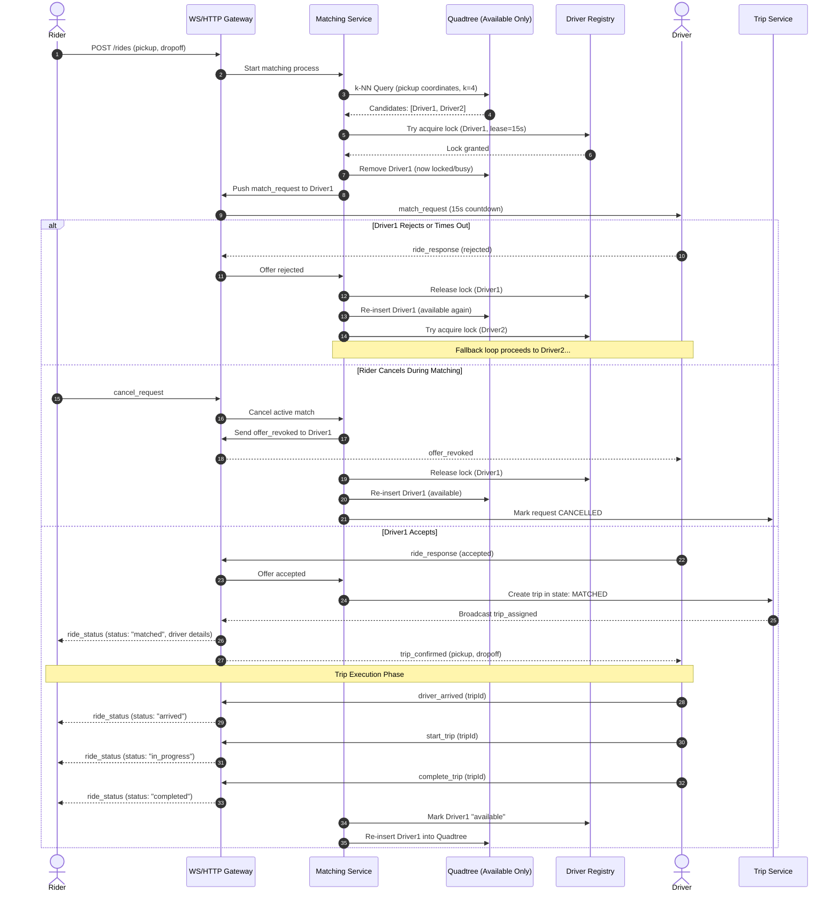

# PRD: Real-Time Ride-Matching Platform

## 1. Overview

A high-performance ride-matching backend that connects riders to the nearest available drivers in real time. It utilizes a custom self-implemented spatial index (Quadtree) and race-condition-safe concurrent matching primitives—built without managed geospatial engines (no Redis Geo, no PostGIS) for v1.

> **Note**: This is a portfolio/learning project demonstrating deep backend engineering concepts: spatial data structures, concurrency control, distributed-style locking, real-time event streaming, and clean state machine management.

---

## 2. Problem Statement

Connecting riders to nearby drivers requires solving four fundamental engineering challenges simultaneously:

1. **Low-Latency Spatial Discovery**: Finding the nearest available drivers quickly without exhaustive scans of every driver on every request.
2. **Safe Concurrency & Distributed State**: Ensuring two riders are never assigned the same driver under high-concurrency request bursts.
3. **Deterministic Lifecycle & Live Streaming**: Managing a strict ride state machine while streaming low-latency bi-directional updates between riders and drivers.
4. **Resilient Session & State Reconciliation**: Handling transient mobile disconnections, driver rejections, and in-flight request revocations without leaving orphan locks or corrupted trip states.

---

## 3. Goals

- **Custom Spatial Index**: Build a production-grade 2D Region Quadtree from scratch supporting `insert`, `remove`, `update`, and branch-and-bound `k-Nearest Neighbors (k-NN)` queries.
- **Race-Condition-Safe Matching**: Implement an atomic claim/lock mechanism preventing double-dispatching and ghost allocations.
- **Real-Time Lifecycle Streaming**: Manage complete trip lifecycles with continuous state synchronization over WebSockets.
- **In-Memory Hot Path**: Keep spatial index and driver location updates strictly in-memory for low-latency dispatch; use persistent storage (Postgres) solely for trip records, state recovery, and audit trails.
- **Robust Reconnection**: Provide seamless client state restoration upon network reconnections.

---

## 4. Non-Goals (v1)

- Payments, fare estimation, ratings, and driver onboarding/KYC.
- Multi-city geo-sharding / horizontal spatial clustering across different geographic regions.
- Real road-network routing and dynamic traffic ETAs (straight-line / Haversine distance with average speed is used; road networks deferred to Phase 2).
- Physical GPS hardware integration (driver movements and trajectories are simulated via automated scripts).

---

## 5. User Personas

| Persona    | Description                                          | Key Interactions                                                                                                                                                                                  |
| :--------- | :--------------------------------------------------- | :------------------------------------------------------------------------------------------------------------------------------------------------------------------------------------------------ |
| **Rider**  | Requests on-demand transport from a pickup location. | Submits ride request (pickup & drop-off), receives real-time dispatch status, tracks matched driver location en route, receives arrival & trip progression notifications, cancels if necessary. |
| **Driver** | Operates a vehicle and fulfills pickup requests.     | Toggles availability (`available`, `busy`, `offline`), streams live GPS coordinates, receives matching offers with a 15-second window, signals arrival, starts trip, completes trip.             |

---

## 6. Functional Requirements

### 6.1 Driver Lifecycle & Controls

- **FR1 (Availability State)**: Driver can toggle operational state: `available`, `busy`, `offline`.
- **FR2 (Telemetry Stream)**: Driver streams continuous location updates via WebSocket while online (every 1–3 seconds).
- **FR3 (Match Offers & Timers)**: Driver receives ride match requests with a strict **15-second countdown** to accept or reject.
- **FR4 (Trip Progression Triggers)**: Driver triggers critical trip milestones over WebSocket:
  - `driver_arrived`: Driver reaches the rider pickup location.
  - `start_trip`: Rider is onboarded; trip begins towards destination.
  - `complete_trip`: Vehicle arrives at drop-off destination; trip is completed.
  - `cancel_trip`: Emergency cancellation prior to pickup (releases driver, triggers re-dispatch or trip termination).
- **FR5 (In-Flight Revocations)**: Driver receives instantaneous notifications when an active offer is revoked (e.g., rider cancelled while driver was considering the offer).

### 6.2 Rider Lifecycle & Controls

- **FR6 (Request Submission)**: Rider submits a ride request with pickup and drop-off coordinates (`pickup_lat`, `pickup_lng`, `dropoff_lat`, `dropoff_lng`) via HTTP (`POST /rides`) or WebSocket (`request_ride`).
- **FR7 (Streaming Lifecycle)**: Rider receives real-time status updates following the strict sequence:
  $$\text{requested} \longrightarrow \text{matching} \longrightarrow \text{matched} \longrightarrow \text{en\_route} \longrightarrow \text{arrived} \longrightarrow \text{in\_progress} \longrightarrow \text{completed}$$
- **FR8 (Live Telemetry Tracking)**: Rider views real-time location telemetry of their matched driver on an interactive map while `en_route` and `in_progress`.
- **FR9 (Rider Cancellation)**: Rider can cancel a ride request while in `matching`, `matched`, `en_route`, or `arrived` states. Cancellation is blocked once the trip enters `in_progress`.

### 6.3 Matching Engine & Concurrency Control

- **FR10 (Available-Only Spatial Index)**: The Quadtree indexes **only `available` (unlocked) drivers**. When a driver is locked or transitions to `busy`/`offline`, they are removed from the tree to guarantee that $k$-NN queries return only actionable candidates.
- **FR11 (Sequential Atomic Locking)**: The system queries the top $N$ closest available drivers and attempts an atomic lock on Candidate 1. If Candidate 1 rejects, times out, or fails to lock, the lock is released, Candidate 1 is returned to the spatial index, and the engine immediately proceeds to Candidate 2.
- **FR12 (Search Bounds & Global Timeout)**: The matching loop attempts up to a maximum of 4 candidates or a total global search duration of 60 seconds. If all candidates reject or the timeout expires, the system transitions to `no_drivers_available`.
- **FR13 (Atomic Offer Revocation)**: If a rider cancels while an offer is counting down on a driver's client:
  1. The pending 15-second offer timer is cancelled.
  2. An `offer_revoked` message is pushed to the driver.
  3. The driver's lock token is released, and the driver is re-inserted into the Quadtree as `available`.
  4. Any subsequent `ride_response: "accepted"` from that driver is rejected with an HTTP/WS 409 Conflict.

### 6.4 Trip Lifecycle & State Machine

- **FR14 (Deterministic State Machine)**: All state transitions adhere to valid transitions:
  - `requested` $\to$ `matching` $\to$ `matched` $\to$ `en_route` $\to$ `arrived` $\to$ `in_progress` $\to$ `completed`
  - Abort transitions to `cancelled` are permitted only from: `matching`, `matched`, `en_route`, and `arrived`.
- **FR15 (Audit Logging)**: Every state transition, lock acquisition, lock expiration, offer rejection, revocation, and trip milestone must be recorded to an append-only `trip_events` audit table.
- **FR16 (Session Reconnection & Sync)**: When a client (rider or driver) reconnects after a network drop, sending a `sync_state` frame immediately returns the client's current active trip, driver location, and valid action states.

---

## 7. Non-Functional Requirements

- **NFR1 (Performance & Latency)**:
  - Spatial $k$-NN queries and driver telemetry updates must run strictly in-memory.
  - Telemetry ingestion incurs zero synchronous database writes on the hot path.
  - Sub-10ms Quadtree lookup latency with 5,000+ active simulated drivers.
- **NFR2 (Concurrency Correctness)**:
  - Strict 0% double-dispatch tolerance under heavy concurrent request spikes.
- **NFR3 (Resilience & Recovery)**:
  - On application startup, the driver registry and spatial index reconstruct their in-memory state from the latest `driver_snapshots` and active `trips`.
- **NFR4 (Connection Continuity)**:
  - WebSocket heartbeat pings (every 10 seconds). Connections with no pong within 30 seconds are pruned, marking idle drivers `offline`.

---

## 8. High-Level Architecture

### 8.1 System Components

```
                +-------------------------------------------------+
                |                   Clients                       |
                |        (Rider App / Driver Simulator)           |
                +------------------------+------------------------+
                                         |
                       HTTP / WebSocket  |
                                         v
         +---------------------------------------------------------------+
         |                       Gateway Layer                           |
         |  - HTTP Endpoints (POST /rides, GET /rides/active)            |
         |  - WebSocket Server (WSDispatcher & ConnectionManager)        |
         +---------------+-------------------------------+---------------+
                         |                               |
        Telemetry Stream |                               | Ride Requests
                         v                               v
         +-------------------------------+ +-----------------------------+
         |        Driver Registry        | |       Matching Service      |
         |  - In-memory driver metadata  | |  - Candidate orchestration  |
         |  - Atomic Lock tokens & TTL   | |  - 15s Offer timeout loop   |
         |  - Availability state flags   | |  - Revocation handler       |
         +---------------+---------------+ +---------------+-------------+
                         ^                                 |
                         | Sync available-only             | Queries available
                         v                                 v
         +-----------------------------------------------+---------------+
         |                  Spatial Index (Quadtree)                     |
         |  - In-memory 2D Region Quadtree (bucket capacity: 8)          |
         |  - Contains EXCLUSIVELY available drivers                     |
         |  - k-NN Priority Queue search / Insert / Remove / In-place    |
         +-------------------------------+-------------------------------+
                                         |
                                         | Trip Lifecycle Milestones
                                         v
         +---------------------------------------------------------------+
         |                         Trip Service                          |
         |  - Strict State Machine Guard                                 |
         |  - Dispatches WebSocket updates to Rider & Driver             |
         +-------------------------------+-------------------------------+
                                         |
                                         | Async Writes & Periodic Snapshots
                                         v
         +---------------------------------------------------------------+
         |                   PostgreSQL Persistence                      |
         |  - trips (Trip entity state)                                  |
         |  - trip_events (Append-only Audit Log)                        |
         |  - driver_snapshots (Periodic crash recovery snapshots)       |
         |  - drivers & riders (Profile definitions)                     |
         +---------------------------------------------------------------+
```

### 8.2 End-to-End Matching & Trip Sequence



---

## 9. API & WebSocket Message Contract

### 9.1 HTTP REST Endpoints

- **`POST /rides`**: Initiates a ride match request.
  - **Headers**: `Content-Type: application/json`, `X-Rider-Id: <UUID>`
  - **Body**:
    ```json
    {
      "pickupLat": 37.7749,
      "pickupLng": -122.4194,
      "dropoffLat": 37.7833,
      "dropoffLng": -122.4167
    }
    ```
  - **Response (202 Accepted)**:
    ```json
    {
      "requestId": "9b1deb4d-3b7d-4bad-9bdd-2b0d7b3dcb6d",
      "status": "matching",
      "createdAt": "2026-09-18T12:00:00Z"
    }
    ```
- **`GET /rides/active`**: Fetches the active trip state for the caller (rider or driver).
- **`POST /rides/{tripId}/cancel`**: HTTP alternative to cancel an active ride.

---

### 9.2 Driver $\leftrightarrow$ Server WebSocket Contract

| Direction               | Message Type      | Payload Fields                                                                            | Purpose                                                   |
| :---------------------- | :---------------- | :---------------------------------------------------------------------------------------- | :-------------------------------------------------------- |
| **Driver $\to$ Server** | `location_update` | `driverId`, `lat`, `lng`, `heading`, `speed`, `timestamp`                                 | Real-time driver GPS telemetry.                           |
| **Driver $\to$ Server** | `ride_response`   | `driverId`, `requestId`, `decision: "accepted" \| "rejected"`                             | Response to match offer.                                  |
| **Driver $\to$ Server** | `status_update`   | `driverId`, `status: "available" \| "busy" \| "offline"`                                  | Manual shift / availability toggle.                       |
| **Driver $\to$ Server** | `driver_arrived`  | `driverId`, `tripId`                                                                      | Driver arrived at rider pickup location.                  |
| **Driver $\to$ Server** | `start_trip`      | `driverId`, `tripId`                                                                      | Rider picked up; trip en route to dropoff.                |
| **Driver $\to$ Server** | `complete_trip`   | `driverId`, `tripId`                                                                      | Destination reached; trip finished.                       |
| **Driver $\to$ Server** | `cancel_trip`     | `driverId`, `tripId`, `reason`                                                            | Emergency driver cancel prior to pickup.                  |
| **Driver $\to$ Server** | `sync_state`      | `driverId`                                                                                | Reconnection handshake to recover current active trip.    |
| **Server $\to$ Driver** | `match_request`   | `requestId`, `pickupLat`, `pickupLng`, `dropoffLat`, `dropoffLng`, `expiresInSec: 15`     | Offer dispatch with countdown.                            |
| **Server $\to$ Driver** | `offer_revoked`   | `requestId`, `reason: "rider_cancelled" \| "timeout"`                                     | In-flight offer cancellation notice.                      |
| **Server $\to$ Driver** | `trip_update`     | `tripId`, `status`, `cancellationReason?`                                                 | Lifecycle update (e.g., rider cancelled).                 |
| **Server $\to$ Driver** | `sync_ack`        | `status`, `activeTrip?: { tripId, status, pickupLat, pickupLng, dropoffLat, dropoffLng }` | Restores driver client state upon connection.             |

---

### 9.3 Rider $\leftrightarrow$ Server WebSocket Contract

| Direction              | Message Type           | Payload Fields                                                                                            | Purpose                                                |
| :--------------------- | :--------------------- | :-------------------------------------------------------------------------------------------------------- | :----------------------------------------------------- |
| **Rider $\to$ Server** | `request_ride`         | `riderId`, `pickupLat`, `pickupLng`, `dropoffLat`, `dropoffLng`                                           | Alternative WebSocket route to submit ride request.    |
| **Rider $\to$ Server** | `cancel_request`       | `riderId`, `requestId`, `tripId?`, `reason?`                                                              | Aborts matching or active uncommenced trip.            |
| **Rider $\to$ Server** | `sync_state`           | `riderId`                                                                                                 | Reconnection handshake to restore active ride state.   |
| **Server $\to$ Rider** | `ride_status`          | `requestId`, `tripId?`, `status: "matching"\|"matched"\|"en_route"\|"arrived"\|"in_progress"\|"completed"\|"cancelled"`, `driver?: { id, name, lat, lng }` | Primary streaming lifecycle status.                    |
| **Server $\to$ Rider** | `driver_location`      | `tripId`, `driverId`, `lat`, `lng`, `heading`, `speed`                                                    | Live driver tracking telemetry during active trip.     |
| **Server $\to$ Rider** | `no_drivers_available` | `requestId`, `reason: "all_rejected" \| "timeout" \| "no_nearby_drivers"`                                 | Dispatched when candidate search is exhausted.         |
| **Server $\to$ Rider** | `sync_ack`             | `activeTrip?: { tripId, requestId, status, driver?: { id, name, lat, lng } }`                             | Restores rider client state upon reconnect.            |

---

## 10. Data Model (Schema Summary)

```
                       +-------------------------+
                       |         riders          |
                       +-------------------------+
                       | id (PK, UUID)           |
                       | name (VARCHAR)          |
                       | email (VARCHAR)         |
                       | created_at (TIMESTAMP)  |
                       +------------+------------+
                                    | 1
                                    |
                                    | *
+-------------------------+    +----+--------------------+    +-------------------------+
|         drivers         |    |          trips          |    |       trip_events       |
+-------------------------+    +-------------------------+    +-------------------------+
| id (PK, UUID)           |    | id (PK, UUID)           |    | id (PK, BIGSERIAL)      |
| name (VARCHAR)          |    | rider_id (FK -> riders) |    | trip_id (FK -> trips)   |
| status (ENUM)           |    | driver_id (FK -> drivers|    | request_id (UUID)       |
| last_known_lat (FLOAT)  |    | request_id (UUID)       |    | event_type (VARCHAR)    |
| last_known_lng (FLOAT)  |    | status (ENUM)           |    | payload (JSONB)         |
| last_seen_at (TIMESTAMP)|    | pickup_lat (FLOAT)      |    | created_at (TIMESTAMP)  |
+------------+------------+    | pickup_lng (FLOAT)      |    +-------------------------+
             | 1               | dropoff_lat (FLOAT)     |
             |                 | dropoff_lng (FLOAT)     |
             |                 | started_at (TIMESTAMP)  |
             | *               | completed_at (TIMESTAMP)|
+------------+------------+    | created_at (TIMESTAMP)  |
|    driver_snapshots     |    +-------------------------+
+-------------------------+
| id (PK, BIGSERIAL)      |
| driver_id (FK -> drivers|
| lat (FLOAT), lng (FLOAT)|
| status (ENUM)           |
| snapshot_at (TIMESTAMP) |
+-------------------------+
```

### Table Definitions

1. **`drivers`**: Permanent driver identities and recovery baseline.
   - `id`: UUID (PK)
   - `name`: String
   - `status`: ENUM (`'available'`, `'busy'`, `'offline'`)
   - `last_known_lat`, `last_known_lng`: Coordinate floats
   - `last_seen_at`: Timestamp (heartbeat tracker)
2. **`riders`**: Passenger profiles.
   - `id`: UUID (PK)
   - `name`: String, `email`: String, `created_at`: Timestamp
3. **`trips`**: Core trip entity records.
   - `id`: UUID (PK)
   - `rider_id`: UUID (FK $\to$ `riders.id`)
   - `driver_id`: UUID (FK $\to$ `drivers.id`, nullable until `matched`)
   - `request_id`: UUID (Idempotency and correlation token)
   - `status`: ENUM (`'requested'`, `'matching'`, `'matched'`, `'en_route'`, `'arrived'`, `'in_progress'`, `'completed'`, `'cancelled'`)
   - `pickup_lat`, `pickup_lng`: Float
   - `dropoff_lat`, `dropoff_lng`: Float
   - `created_at`, `started_at`, `completed_at`: Timestamps
4. **`trip_events`**: Append-only audit log for every operational transition.
   - `id`: BigSerial (PK)
   - `trip_id`: UUID (FK $\to$ `trips.id`, nullable)
   - `request_id`: UUID
   - `event_type`: String (e.g., `'LOCK_ACQUIRED'`, `'LOCK_RELEASED'`, `'OFFER_DISPATCHED'`, `'OFFER_REJECTED'`, `'OFFER_REVOKED'`, `'STATUS_TRANSITION'`)
   - `payload`: JSONB (captures timestamps, coordinate snapshots, transition details)
   - `created_at`: Timestamp
5. **`driver_snapshots`**: Crash-recovery snapshots written periodically (e.g. every 30s) or on shutdown.
   - `id`: BigSerial (PK)
   - `driver_id`: UUID (FK $\to$ `drivers.id`)
   - `lat`, `lng`: Float
   - `status`: ENUM (`'available'`, `'busy'`, `'offline'`)
   - `snapshot_at`: Timestamp

---

## 11. Module Boundaries & Algorithmic Details

### 11.1 SpatialIndex (Custom 2D Region Quadtree)

- **Structure**:
  - Each node represents a 2D bounding box `[minLat, maxLat, minLng, maxLng]`.
  - Leaf nodes store up to **bucket capacity = 8** driver items.
  - When the 9th driver is inserted, the node splits into 4 child quadrants: **North-West (NW)**, **North-East (NE)**, **South-West (SW)**, and **South-East (SE)**.
  - Reverse lookup map `Map<driverId, LeafNode>` enables $O(1)$ node location for updates and removals.
- **Available-Only Invariant**:
  - To prevent $k$-NN queries from wasting cycles evaluating busy or offline drivers, **only `available` drivers exist in the tree**.
  - On driver lock / offer dispatch $\to$ `Remove(driverId)`.
  - On offer rejection / cancel / completion $\to$ `Insert(driverId, lat, lng)`.
- **In-Place Location Update Optimization**:
  - When continuous telemetry arrives, if the driver's new coordinates remain within the boundary of their current `LeafNode`, update the coordinates directly in-place ($O(1)$). Only if the driver crosses the leaf boundary does the tree execute `Remove` and re-`Insert`.
- **$k$-Nearest Neighbors ($k$-NN)**:
  - Uses a **Branch-and-Bound search with a Priority Queue**.
  - Priority queue orders nodes and points by minimum distance to the query point.
  - Distances are evaluated using Haversine formula (or equirectangular approximation for fast local Euclidean bounds checking).

### 11.2 DriverRegistry & Atomic In-Memory Locks

- Tracks in-memory driver metadata:
  ```ts
  interface DriverEntry {
    driverId: string;
    lat: number;
    lng: number;
    status: 'available' | 'busy' | 'offline';
    lastHeartbeat: number;
    lockToken?: {
      requestId: string;
      expiresAt: number;
    };
  }
  ```
- **Lock Acquisition**:
  - Driver can only be locked if `status === 'available'` and (`!lockToken || lockToken.expiresAt < now()`).
  - Lock duration is set to 15 seconds (`now() + 15_000`).
  - Atomic CAS operation: immediately sets lock token and marks driver unavailable in spatial index.
- **Lock Release / Revocation**:
  - Clears `lockToken` and re-enables driver availability.

### 11.3 MatchingService

- Manages the sequential fallback loop:
  1. Calls `SpatialIndex.kNearestNeighbors(pickup, k=4)`.
  2. For each candidate: acquires lock $\to$ removes candidate from Quadtree $\to$ sends `match_request` over WebSocket $\to$ arms 15s timer.
  3. If response is `"rejected"` or timer fires: releases lock $\to$ re-inserts candidate into Quadtree $\to$ advances to next candidate.
  4. If all candidates exhausted or global 60s timeout expires: emits `no_drivers_available`.
  5. If rider cancels during loop: emits `offer_revoked` to current candidate, unlocks driver, and terminates loop.

### 11.4 TripService

- Strict State Machine validator:
  - Validates all requests to advance state against allowed transitions.
  - Dispatches audit events to `trip_events` (via an asynchronous, non-blocking queue/worker).
  - Emits updates to rider and driver via `WSDispatcher`.

---

## 12. Phase 2 (Future Extensions)

- **Graph-Based Routing & ETA**: Integrate an in-memory road-network graph running Dijkstra/A\* routing. The Quadtree serves as an initial spatial filter, followed by graph-distance-based candidate ranking.
- **Dynamic Surge & Pricing**: Geospatial density heatmaps derived from Quadtree depth counts to calculate localized surge multipliers.
- **Distributed Redis Redlock**: Scaling the matching engine horizontally across multiple service nodes.

---

## 13. Success Metrics

- **Zero Double-Dispatch**: 0% duplicate driver assignments during concurrent synthetic load tests ($100+$ simultaneous requests).
- **Sub-10ms Spatial Lookup**: Quadtree $k$-NN lookup execution under $10\text{ms}$ with $5{,}000+$ active simulated drivers.
- **Deterministic State Consistency**: 100% of trips reach a terminal state (`completed` or `cancelled`) with a complete audit trail in `trip_events`.
- **End-to-End Visual Demo**: Fully functional interactive web simulation with simulated driver agents moving towards riders in real time.

---

## 14. Architectural Decisions Record (ADR)

1. **Available-Only Quadtree Policy**:
   - *Decision*: Only `available` drivers are indexed in the Quadtree.
   - *Rationale*: Eliminates candidate starvation during peak hours where the nearest $k$ drivers are all busy. Ensures that every candidate returned by a spatial query is instantly actionable.
2. **Sequential Offer Window with Global Cap**:
   - *Decision*: 15-second timer per candidate, capped at 4 candidates or 60 seconds total.
   - *Rationale*: Protects rider UX by preventing 90-second wait times while giving each individual driver adequate time to respond.
3. **Offer Revocation & CAS Lock Tokens**:
   - *Decision*: Atomic lock token with lease expiry and WebSocket `offer_revoked` push.
   - *Rationale*: Resolves the classic race condition where a rider cancels while a driver is deciding. Guarantees that drivers are never assigned to a ghost ride.
4. **Heartbeat Lease & Stale Eviction**:
   - *Decision*: 10-second client pings, 30-second lease expiration.
   - *Rationale*: Ensures disconnected or crashed drivers are automatically evicted from the spatial index within 30 seconds without blocking the matching pool.
