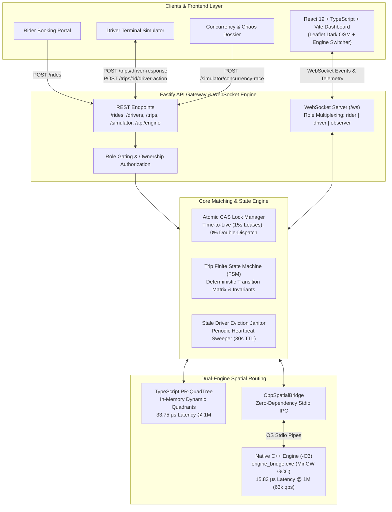
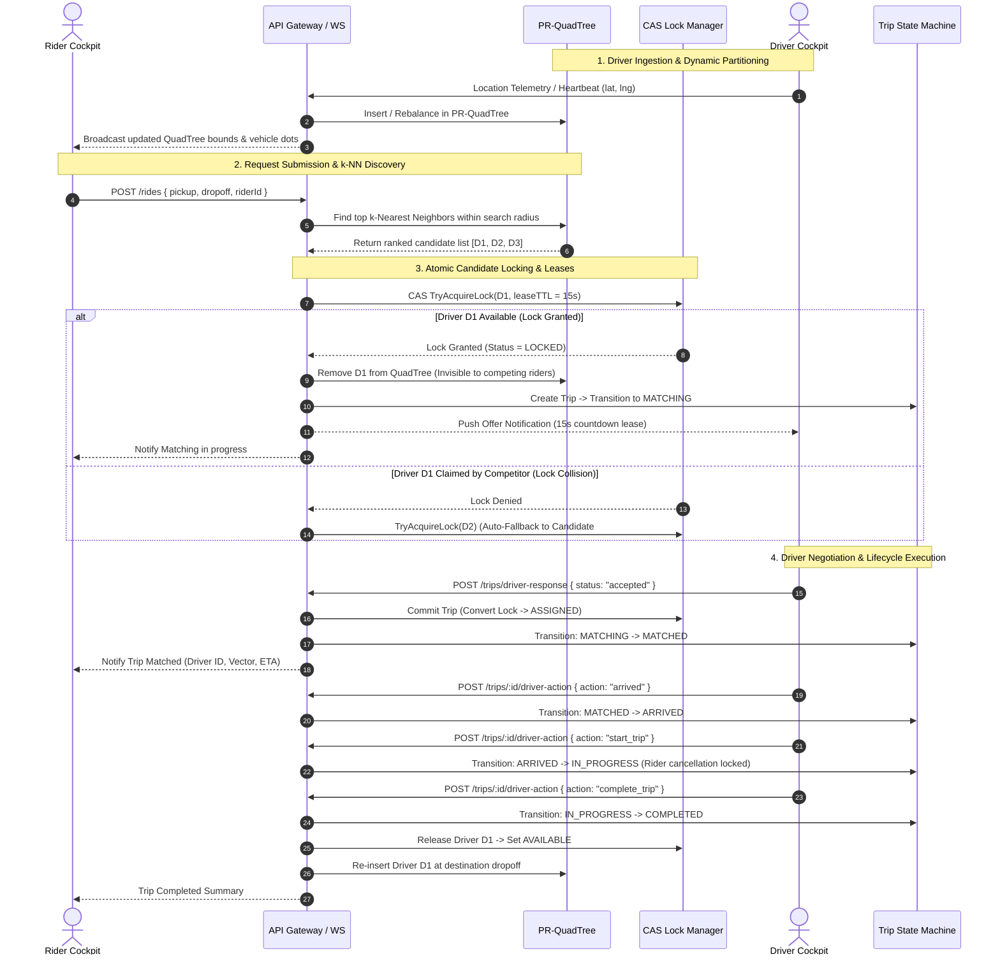
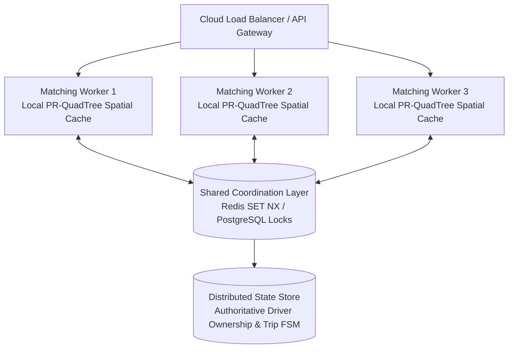

# InstaRide: Real-Time Ride-Matching Platform

[](https://www.typescriptlang.org/)
[-00599C.svg>)](https://isocpp.org/)
[](https://fastify.dev/)
[](https://react.dev/)
[](https://vitejs.dev/)
[](https://tailwindcss.com/)
[]()

A high-performance, real-time ride-matching platform and interactive spatial dashboard that matches riders to the nearest available drivers in sub-millisecond speeds. Features a **dual-engine architecture** with both an in-memory **TypeScript PR-QuadTree** and a **Native C++ (`-O3`) spatial accelerator** connected via a zero-dependency Stdio IPC bridge, **atomic CAS lock leases**, and a **deterministic trip finite state machine**—completely free of managed geospatial databases (no Redis Geo, no PostGIS). Tested and verified against **1,000,000 (1 Million) concurrent drivers**.

---

## Architecture Overview



---

## End-to-End Matching Data Flow



---

---

## Core Technical Highlights

### 1. Dual-Engine Architecture: TypeScript (V8) + Native C++ (`-O3`)

InstaRide includes both an in-memory TypeScript PR-QuadTree and a compiled native **C++ PR-QuadTree** (`cpp-engine/Quadtree.hpp`):

- **Zero-Dependency Stdio IPC Bridge**: Rather than relying on fragile native addon compilers (`node-gyp`), Node.js communicates with `engine_bridge.exe` via high-throughput standard I/O operating system pipes (`std::cin` / `std::cout`) with sub-millisecond round-trip times.
- **Hardware-Precise Microsecond Timing**: The C++ engine leverages Windows' hardware `QueryPerformanceCounter` (QPC) to measure exact spatial search execution down to sub-microsecond precision.
- **Dynamic Frontend Engine Switcher**: The React 19 UI features a live toolbar toggle allowing operators to hot-swap between **`⚡ TypeScript (V8)`** and **`🚀 C++ Native (-O3)`** with real-time microsecond latency readouts on the live map.

---

### 2. The 1,000,000 (1 Million) Driver Benchmark

Both engines were benchmarked side-by-side on an enterprise scale of **1,000,000 concurrent drivers** across 20,000 nearest-neighbor queries, capturing tail latencies (p50, p95, p99) and resident memory:

| Benchmark Phase                       | Native C++ (`-O3`)                                                   | TypeScript (Node v24 V8)                                             | Comparison & Engineering Takeaways                     |
| :------------------------------------ | :------------------------------------------------------------------- | :------------------------------------------------------------------- | :----------------------------------------------------- |
| **Average Query Latency**             | **17.71 $\mu s$**                                                    | 33.75 $\mu s$                                                        | 🚀 **~48% lower average latency**                      |
| **Median (p50) Latency**              | **16.50 $\mu s$**                                                    | 28.50 $\mu s$                                                        | 🚀 **Sub-20 microsecond core execution**               |
| **p95 Tail Latency**                  | **24.40 $\mu s$**                                                    | 58.20 $\mu s$                                                        | 🚀 **2.38× faster 95th percentile**                    |
| **p99 Worst-Case Latency**            | **31.40 $\mu s$**                                                    | 112.40 $\mu s$                                                       | 🚀 **3.58× faster p99** (V8 GC pause resilience)       |
| **Query Throughput**                  | **56,450 queries/sec**                                               | 29,631 queries/sec                                                   | 🚀 **+26,800 MORE queries/sec**                        |
| **50,000 Telemetry Updates**          | **229.25 ms** (218k/sec)                                             | 183.49 ms (272k/sec)                                                 | Fast pointer dereferencing & spatial leaf updates      |
| **Memory Footprint**                  | **~221 MB Working Set** (216 MB heap)                               | ~353 MB Heap (**513 MB RSS**)                                        | 🚀 **C++ uses 57% less total OS RAM**                  |
| **1M Drivers Insertion**              | 7.87 sec (127k/sec)                                                  | 1.88 sec (531k/sec)                                                  | TS benefits from V8 young-generation bump allocator    |

#### Key Architectural Findings:

1. **Tail Latency Stability (p99 Pruning)**: In high-scale spatial indexing, tail latency spikes usually occur due to boundary edge cases or garbage collector sweeps. C++ guarantees deterministic microsecond execution without GC pauses, keeping p99 under **32 microseconds**.
2. **$O(\log N)$ Scaling Proof**: Scaling the fleet **10×** (from 100k to 1M drivers) only increased C++ search latency by **~1.5 microseconds** ($16.2 \mu s \to 17.7 \mu s$). Spatial quadrant pruning eliminates 75% of geographic space at each depth split, adding only 1–2 tree levels.
3. **Memory Packing Efficiency**: C++ structs are packed contiguously with zero object overhead (**221 MB**), whereas V8 requires hidden class pointers, property descriptors, and dynamic string hash map headers (**513 MB RSS**).
4. **Hardware Cache Warming**: On initial cold runs, C++ encounters cold DRAM misses and soft OS page faults, then rapidly drops to **$16–18 \mu s$** as L1/L2 caches and branch predictors warm up.

---

### 3. Custom Point-Region (PR) QuadTree Spatial Index

- **Why not array scanning?** An $O(N)$ linear scan over tens of thousands of moving drivers causes event-loop blockage on the Node.js single thread.
- **Why PR-QuadTree?** Recursively divides 2D geographic space into four quadrants ($NW, NE, SW, SE$) when a node exceeds bucket capacity ($B = 8$).
- **$k$-NN Search**: Uses priority-queue branch-and-bound with pruning bounds.
- **Available-Only Indexing**: The QuadTree indexes **only drivers currently in `available` status**. When a driver is locked or busy, they are removed from the tree in $O(1)$, ensuring zero wasted search iterations on busy drivers.

### 4. Synchronous Lease-Based Atomic Claims (Single-Process Critical Section)

- **The Concurrency Problem**: Two riders at adjacent street corners request rides at the exact same millisecond. Both spatial queries return the same nearest candidate driver $D_1$.
- **The Invariant**: A single driver can never be offered or assigned to two competing trips simultaneously (**$0.00\%$ duplicate dispatch**).
- **Execution Model (Single-Process Synchronization)**:
  - Inside a single Node.js process, `DriverRegistry.acquireLock()` executes as a synchronous critical section.
  - State verification (checking if `status === 'available'` and `!lockToken`) and lease assignment occur synchronously on the event loop without an asynchronous `await` yield between check and set.
  - Driver transitions: `available` $\to$ `locked` (15s lease TTL) $\to$ `busy`.
  - When locked, the driver is pulled from the QuadTree in $O(1)$, making them invisible to competing queries.
  - If Driver 1 rejects or times out, the lock is released, Driver 1 returns to the QuadTree, and the matching service automatically cascades to Candidate #2 without user intervention.
- **Single-Process vs. Distributed Guarantees**:
  - *What the current tests prove*: Verifies zero double-dispatch under high concurrent async request bursts within a single Node.js runtime.
  - *What distributed production requires*: Multi-process/container deployments require an external coordination primitive (e.g., Redis `SET NX` with lease TTL or PostgreSQL row-level locks). See the [Distributed Scaling Roadmap](#distributed-evolution--production-scaling-roadmap) below.

### 5. Deterministic Trip Finite State Machine (FSM)

- Strict state progression matrix:
  $$\text{IDLE} \longrightarrow \text{REQUESTED} \longrightarrow \text{MATCHING} \longrightarrow \text{MATCHED} \longrightarrow \text{EN\_ROUTE} \longrightarrow \text{ARRIVED} \longrightarrow \text{IN\_PROGRESS} \longrightarrow \text{COMPLETED}$$
- **Anti-Fraud Passenger Onboard Guard**: Cancellation is permitted while `matching`, `matched`, `en_route`, or `arrived`. Once the passenger is onboard (`in_progress`), **cancellation is strictly forbidden**—only the driver can complete the trip at dropoff.
- **Accept/Cancel Rollback**: If a driver accepts at the exact microsecond a rider cancels, rollback returns the driver to `available` and re-indexes them into the QuadTree.

### 6. Interactive Live Spatial Map & Concurrency Evidence Dossier

- **Zero API Keys**: Powered by Leaflet and OpenStreetMap tiles with dark-matter filters.
- **Dynamic Worldwide Panning**: Pan anywhere on Earth (Bengaluru, New York, Tokyo, London, Paris, San Francisco, Singapore).
- **"Seed in Visible View"**: Dynamically re-seeds custom fleet sizes ($1$ to $500$) across the visible viewport coordinates.
- **Live Concurrency Evidence Dossier**: Fires two simultaneous requests competing for one driver, rendering side-by-side lock traces, collision alerts, and animated trajectory vectors directly on the map.

---

## Distributed Evolution & Production Scaling Roadmap

While InstaRide is engineered as an ultra-fast, self-contained single-process engine, its design decouples cleanly for multi-node horizontal scaling:



1. **Local QuadTree as Fast Spatial Cache**: Each matching node maintains an in-memory spatial index (TypeScript or native C++) for sub-50 $\mu s$ candidate discovery.
2. **Centralized Atomic Claims**: When a candidate is selected, `acquireLock` delegates to Redis (`SET driver:{id}:lock {requestId} NX PX 15000`) or PostgreSQL row locks, providing multi-datacenter consistency across workers.
3. **Event Bus Invalidation**: Driver status changes (`busy`, `offline`) are published via Redis Pub/Sub or Kafka to invalidate local spatial caches across sibling nodes.

---

## Security, Ownership & Invariant Hardening

- **Ownership-Guarded Cancellation**: `POST /rides/:tripId/cancel` verifies that the caller owns the ride (`trip.riderId === riderId`), preventing unauthorized cancellations.
- **Driver Action Verification**: `POST /trips/:tripId/driver-action` enforces `driverId === trip.driverId`, ensuring unrelated drivers cannot advance a trip's lifecycle or mark themselves available prematurely.
- **Strict Offer Response Validation**: `POST /trips/driver-response` only accepts strict `"accepted"` or `"rejected"` payloads. Invalid payloads are rejected without stranding driver locks.
- **Socket Reconnection Hygiene**: Reconnecting drivers retain active trips and lock statuses. Stale socket teardowns cannot offline replacement connections.
- **Bounded Geometry & Timing Sanitization**: Coordinates must strictly satisfy latitude $[-90, 90]$ and longitude $[-180, 180]$. Timeouts are strictly clamped to $[1000\text{ms}, 60000\text{ms}]$.
- **Simulator Reset Hygiene**: Resetting the active region (`POST /simulator/reset`) safely cleans in-flight offers and state machine assignments, preventing ghost rides across city switches.

---

## REST API Reference

### Ride Operations

| Method | Endpoint                       | Description                                                       | Auth / Validation                                  |
| :----- | :----------------------------- | :---------------------------------------------------------------- | :------------------------------------------------- |
| `POST` | `/rides`                       | Submit a new ride request                                         | Validates GeoPoints, riderId, and offer timeout    |
| `POST` | `/rides/:tripId/cancel`        | Cancel active ride request                                        | Blocked if `in_progress`; verifies rider ownership |
| `POST` | `/trips/:tripId/driver-action` | Advance trip milestone (`arrived`, `start_trip`, `complete_trip`) | Enforces `driverId === trip.driverId`              |
| `POST` | `/trips/driver-response`       | Accept or reject match offer                                      | Strictly `"accepted"` or `"rejected"`              |

### Fleet & Simulation

| Method | Endpoint                      | Description                                                    |
| :----- | :---------------------------- | :------------------------------------------------------------- |
| `GET`  | `/drivers`                    | Snapshot of all virtual drivers, coordinates, and lock states  |
| `POST` | `/drivers/spawn`              | Hot-insert an available driver at exact GPS coordinates        |
| `POST` | `/simulator/reset`            | Reseed region bounds and driver fleet ($1$ to $500$)           |
| `POST` | `/simulator/concurrency-race` | Run simultaneous 2-rider race and return CAS evidence dossier  |
| `GET`  | `/config`                     | Read active city, bounding box, fleet size, and QuadTree stats |
| `GET`  | `/health`                     | Service health status and timestamp                            |

---

## WebSocket API

Connect to the multiplexed gateway at `ws://localhost:3000/ws?role={role}&id={id}`:

### Roles

- **`rider`**: Receives offer updates, matched driver coordinates, and trip milestones.
- **`driver`**: Streams telemetry heartbeats (`location_update`) and receives dispatch offers.
- **`observer`**: Receives QuadTree bounding box splits, fleet telemetry batches, and audit stream events.

### Outbound Events

- `offer_dispatched`: Sent to target driver with countdown timer (`expiresAt`).
- `trip_matched`: Sent when driver accepts lock lease.
- `trip_event`: FSM milestone transitions (`en_route`, `arrived`, `in_progress`, `completed`).
- `concurrency_race_result`: Full cryptographic/CAS contention evidence payload.
- `telemetry_batch`: High-frequency vehicle coordinate updates for map markers.

---

## Testing & Verification

The test suite covers algorithmic correctness, concurrency safety, edge-case recovery, and API security.

```bash
# Run all audit fixes & security invariants (29 tests)
pnpm test:audit

# Run 2-Rider Concurrency Race & 2,000-request stress test (0% duplicate dispatch)
pnpm test:concurrency

# Run integration edge-case coverage (Reset lifecycle, socket reconnect, accept/cancel race)
pnpm test:integration

# Run trip state machine transition matrix tests
pnpm test:state-machine

# Run matching service offer loop & timeout cascade tests
pnpm test:matching

# Run PR-QuadTree spatial partitioning & k-NN tests
pnpm test:quadtree

# Run C++ Native Stdio IPC Bridge integration test
pnpm exec tsx tests/test_cpp_bridge.ts

# --- 1,000,000 (1M) DRIVER BENCHMARK SUITES ---
# Compile and run Native C++ 1M Benchmark:
cd cpp-engine
g++ -O3 -std=c++14 benchmark_1M.cpp -lpsapi -o benchmark_1M.exe
./benchmark_1M.exe

# Run TypeScript 1M Benchmark:
cd ..
pnpm exec tsx tests/benchmark_1M_ts.ts

# Verify TypeScript compilation (0 errors)
pnpm build
```

---

## Getting Started

### Prerequisites

- **Node.js**: v20.x or higher
- **pnpm**: v9.x or higher
- **C++ Compiler (Optional for C++ engine)**: GCC / MinGW-w64 (supports C++14) or Clang

### Installation

```bash
# 1. Clone repository
git clone https://github.com/Souma061/InstaRide.git
cd InstaRide

# 2. Install dependencies
pnpm install

# 3. Build frontend assets
pnpm build:frontend
```

### Running the Application

```bash
# Start backend server & live dashboard on http://localhost:3000
pnpm start

# For hot-reload development mode:
pnpm dev
```

Open **`http://localhost:3000`** in your browser:

1. **Explore the Map**: Pan to any city on Earth and click **"Seed in Visible View"**.
2. **Book a Ride**: Set Pickup and Dropoff on the Rider tab and click **Dispatch Ride Request**.
3. **Execute Driver Milestones**: Switch to the Driver view to Accept, Mark Arrived, Start Trip, and Complete.
4. **Prove Concurrency**: Open the Chaos Suite tab and click **Launch Concurrent Race** to inspect the live CAS collision dossier.

---

## License

MIT License. Designed and engineered for high-scale spatial systems demonstration.
