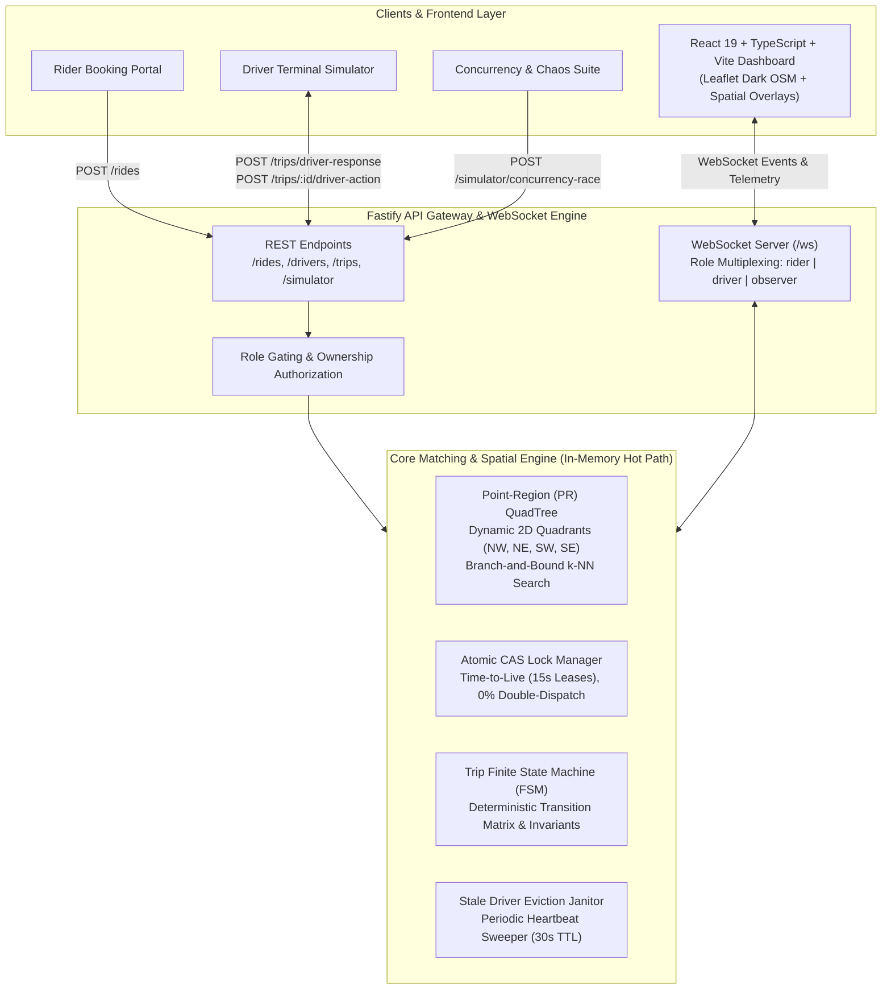
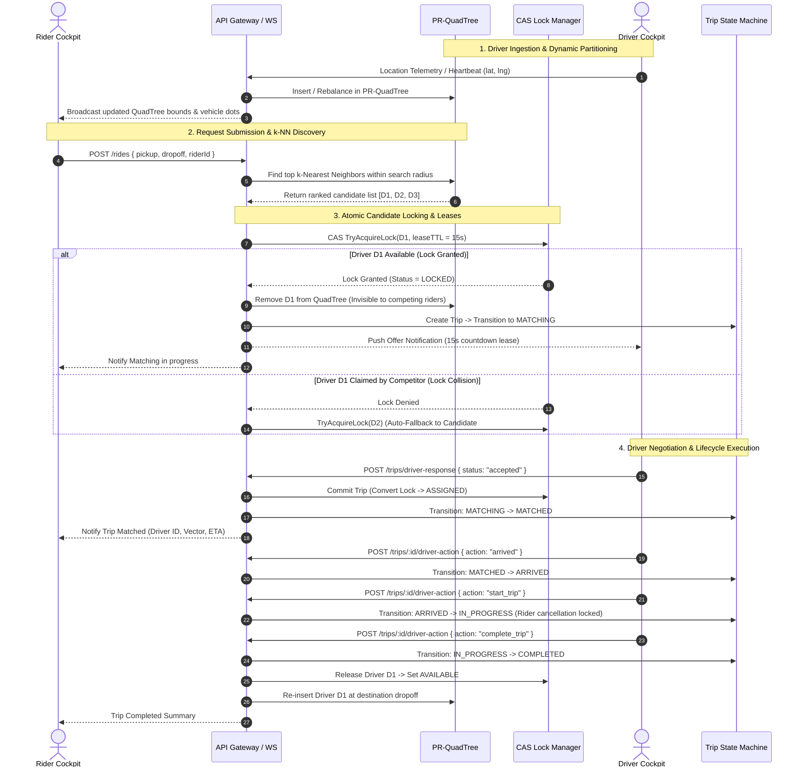

# InstaRide: Real-Time Ride-Matching Platform

[](https://www.typescriptlang.org/)
[](https://fastify.dev/)
[](https://react.dev/)
[](https://vitejs.dev/)
[](https://tailwindcss.com/)
[]()

A high-performance, real-time ride-matching backend and interactive spatial dashboard that matches riders to the nearest available drivers in sub-10 milliseconds. Built with a **custom Point-Region (PR) QuadTree spatial index**, **atomic CAS lock leases**, and a **deterministic trip finite state machine**—completely free of managed geospatial engines (no Redis Geo, no PostGIS).

---

## Architecture Overview



---

## End-to-End Matching Data Flow



---

## Core Technical Highlights

### 1. Custom Point-Region (PR) QuadTree Spatial Index

- **Why not array scanning?** An $O(N)$ linear scan over tens of thousands of moving drivers causes event-loop blockage on the Node.js single thread.
- **Why PR-QuadTree?** Recursively divides 2D geographic space into four quadrants ($NW, NE, SW, SE$) when a node exceeds bucket capacity ($B = 8$).
- **$k$-NN Search**: Uses priority-queue branch-and-bound with pruning bounds.
- **Available-Only Indexing**: The QuadTree indexes **only drivers currently in `available` status**. When a driver is locked or busy, they are removed from the tree in $O(1)$, ensuring zero wasted search iterations on busy drivers.

### 2. Atomic Compare-And-Swap (CAS) & Lease Manager

- **The Concurrency Problem**: Two riders at adjacent street corners request rides at the exact same millisecond. Both spatial queries return the same nearest driver $D_1$.
- **The Invariant**: A single driver can never be offered or assigned to two competing trips simultaneously (**$0.00\%$ duplicate dispatch**).
- **Lease Mechanism**:
  - Driver transitions atomically: `available` $\to$ `locked` $\to$ `busy`.
  - When an offer is dispatched, the driver receives a timestamped lock lease (15-second TTL).
  - If Driver 1 rejects or times out, the lock is released, Driver 1 returns to the QuadTree, and the engine automatically cascades to Candidate #2 without user intervention.

### 3. Deterministic Trip Finite State Machine (FSM)

- Strict state progression matrix:
  $$\text{IDLE} \longrightarrow \text{REQUESTED} \longrightarrow \text{MATCHING} \longrightarrow \text{MATCHED} \longrightarrow \text{EN\_ROUTE} \longrightarrow \text{ARRIVED} \longrightarrow \text{IN\_PROGRESS} \longrightarrow \text{COMPLETED}$$
- **Anti-Fraud Passenger Onboard Guard**: Cancellation is permitted while `matching`, `matched`, `en_route`, or `arrived`. Once the passenger is onboard (`in_progress`), **cancellation is strictly forbidden**—only the driver can complete the trip at dropoff.
- **Accept/Cancel Rollback**: If a driver accepts at the exact microsecond a rider cancels, rollback returns the driver to `available` and re-indexes them into the QuadTree.

### 4. Interactive Live Spatial Map & Concurrency Evidence Dossier

- **Zero API Keys**: Powered by Leaflet and OpenStreetMap tiles with dark-matter filters.
- **Dynamic Worldwide Panning**: Pan anywhere on Earth (Bengaluru, New York, Tokyo, London, Paris, San Francisco, Singapore).
- **"Seed in Visible View"**: Dynamically re-seeds custom fleet sizes ($1$ to $500$) across the visible viewport coordinates.
- **Live Concurrency Evidence Dossier**: Fires two simultaneous requests competing for one driver, rendering side-by-side atomic lock traces, collision alerts, and animated trajectory vectors directly on the map.

---

## Security, Ownership & Invariant Hardening

- **Ownership-Guarded Cancellation**: `POST /rides/:tripId/cancel` verifies that the caller owns the ride (`trip.riderId === riderId`), preventing unauthorized cancellations.
- **Driver Action Verification**: `POST /trips/:tripId/driver-action` enforces `driverId === trip.driverId`, ensuring unrelated drivers cannot advance a trip's lifecycle or mark themselves available prematurely.
- **Strict Offer Response Validation**: `POST /trips/driver-response` only accepts strict `"accepted"` or `"rejected"` payloads. Invalid payloads are rejected without stranding driver locks.
- **Socket Reconnection Hygiene**: Reconnecting drivers retain active trips and lock statuses. Stale socket teardowns cannot offline replacement connections.
- **Bounded Geometry & Timing Sanitization**: Coordinates must strictly satisfy latitude $[-90, 90]$ and longitude $[-180, 180]$. Timeouts are strictly clamped to $[1000\text{ms}, 60000\text{ms}]$.
- **Simulator Reset Hygiene**: Resetting the active region (`POST /simulator/reset`) safely cleans in-flight offers and state machine assignments, preventing ghost rides across city switches.

---

## REST API Reference

### Ride Operations

| Method | Endpoint                       | Description                                                       | Auth / Validation                                  |
| :----- | :----------------------------- | :---------------------------------------------------------------- | :------------------------------------------------- |
| `POST` | `/rides`                       | Submit a new ride request                                         | Validates GeoPoints, riderId, and offer timeout    |
| `POST` | `/rides/:tripId/cancel`        | Cancel active ride request                                        | Blocked if `in_progress`; verifies rider ownership |
| `POST` | `/trips/:tripId/driver-action` | Advance trip milestone (`arrived`, `start_trip`, `complete_trip`) | Enforces `driverId === trip.driverId`              |
| `POST` | `/trips/driver-response`       | Accept or reject match offer                                      | Strictly `"accepted"` or `"rejected"`              |

### Fleet & Simulation

| Method | Endpoint                      | Description                                                    |
| :----- | :---------------------------- | :------------------------------------------------------------- |
| `GET`  | `/drivers`                    | Snapshot of all virtual drivers, coordinates, and lock states  |
| `POST` | `/drivers/spawn`              | Hot-insert an available driver at exact GPS coordinates        |
| `POST` | `/simulator/reset`            | Reseed region bounds and driver fleet ($1$ to $500$)           |
| `POST` | `/simulator/concurrency-race` | Run simultaneous 2-rider race and return CAS evidence dossier  |
| `GET`  | `/config`                     | Read active city, bounding box, fleet size, and QuadTree stats |
| `GET`  | `/health`                     | Service health status and timestamp                            |

---

## WebSocket API

Connect to the multiplexed gateway at `ws://localhost:3000/ws?role={role}&id={id}`:

### Roles

- **`rider`**: Receives offer updates, matched driver coordinates, and trip milestones.
- **`driver`**: Streams telemetry heartbeats (`location_update`) and receives dispatch offers.
- **`observer`**: Receives QuadTree bounding box splits, fleet telemetry batches, and audit stream events.

### Outbound Events

- `offer_dispatched`: Sent to target driver with countdown timer (`expiresAt`).
- `trip_matched`: Sent when driver accepts lock lease.
- `trip_event`: FSM milestone transitions (`en_route`, `arrived`, `in_progress`, `completed`).
- `concurrency_race_result`: Full cryptographic/CAS contention evidence payload.
- `telemetry_batch`: High-frequency vehicle coordinate updates for map markers.

---

## Testing & Verification

The test suite covers algorithmic correctness, concurrency safety, edge-case recovery, and API security.

```bash
# Run all audit fixes & security invariants (29 tests)
pnpm test:audit

# Run 2-Rider Concurrency Race & 2,000-request stress test (0% duplicate dispatch)
pnpm test:concurrency

# Run integration edge-case coverage (Reset lifecycle, socket reconnect, accept/cancel race)
pnpm test:integration

# Run trip state machine transition matrix tests
pnpm test:state-machine

# Run matching service offer loop & timeout cascade tests
pnpm test:matching

# Run PR-QuadTree spatial partitioning & k-NN tests
pnpm test:quadtree

# Verify TypeScript compilation (0 errors)
pnpm build
```

---

## Getting Started

### Prerequisites

- **Node.js**: v20.x or higher
- **pnpm**: v9.x or higher

### Installation

```bash
# 1. Clone repository
git clone https://github.com/Souma061/InstaRide.git
cd InstaRide

# 2. Install dependencies
pnpm install

# 3. Build frontend assets
pnpm build:frontend
```

### Running the Application

```bash
# Start backend server & live dashboard on http://localhost:3000
pnpm start

# For hot-reload development mode:
pnpm dev
```

Open **`http://localhost:3000`** in your browser:

1. **Explore the Map**: Pan to any city on Earth and click **"Seed in Visible View"**.
2. **Book a Ride**: Set Pickup and Dropoff on the Rider tab and click **Dispatch Ride Request**.
3. **Execute Driver Milestones**: Switch to the Driver view to Accept, Mark Arrived, Start Trip, and Complete.
4. **Prove Concurrency**: Open the Chaos Suite tab and click **Launch Concurrent Race** to inspect the live CAS collision dossier.

---

## License

MIT License. Designed and engineered for high-scale spatial systems demonstration.
