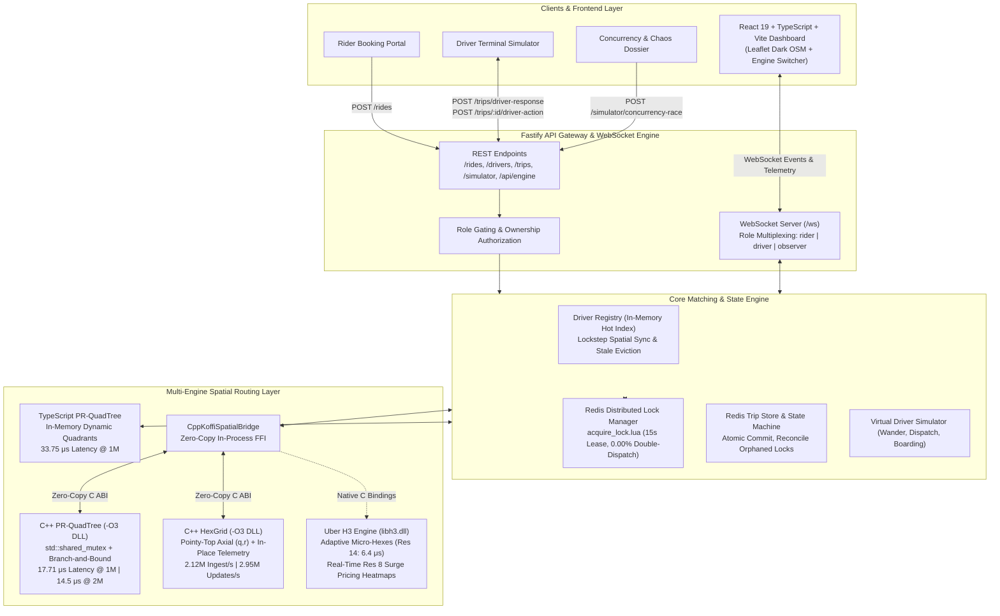
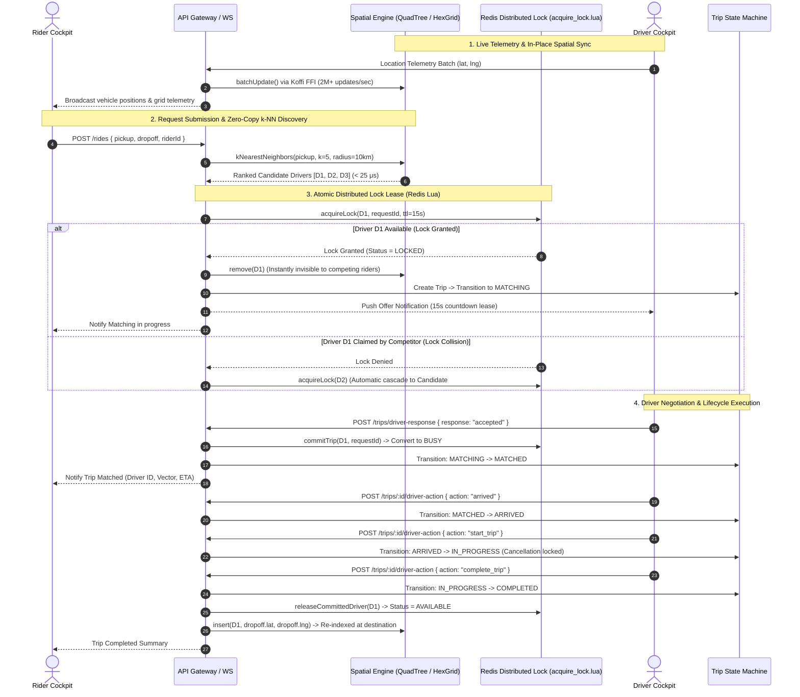

# InstaRide: Real-Time Ride-Matching Platform

[](https://www.typescriptlang.org/)
[-00599C.svg)](https://isocpp.org/)
[](https://h3geo.org/)
[](https://koffi.dev/)
[](https://fastify.dev/)
[](https://redis.io/)
[](https://react.dev/)
[](https://tailwindcss.com/)
[-emerald.svg)]()

A high-performance, real-time ride-matching platform and spatial visualization system that matches riders to nearest available drivers in microsecond latencies. Features a **multi-engine spatial architecture** comparing **Point-Region QuadTrees** against **Hexagonal Grids & Uber H3**, connected directly into Node.js via **zero-copy in-process Koffi FFI**, **Redis distributed CAS lock leases (`acquire_lock.lua`)**, and a **deterministic trip finite state machine**—free of managed spatial databases (no PostGIS, no Redis Geo). Tested and verified up to **2,000,000 (2 Million) concurrent drivers**.

---

## Architecture Overview



---

## End-to-End Matching Data Flow



---

## Core Technical Highlights

### 1. In-Process Zero-Copy FFI Bridge (Koffi)

The engine integrates native 64-bit C++ shared libraries (`quadtree.dll` and `hexgrid.dll`) directly into the Node.js process using **Koffi FFI**:

- **No OS Pipe Overhead**: Replaced legacy child-process stdio pipes with zero-copy in-process C exports (`extern "C"`).
- **Sub-Microsecond Struct Marshalling**: C structs (`CandidateC`, `DriverUpdateC`) are mapped directly to memory buffers without stringification or JSON serialization.
- **Microsecond Query Speed**: k-NN dispatch queries return in **$24.0\text{ }\mu s$ to $42.5\text{ }\mu s$** directly to TypeScript.
- **Hot-Swappable Runtime**: Select between `"ts"`, `"cpp_quadtree"`, and `"cpp_hexgrid"` on the fly via `POST /api/engine/select`.

---

### 2. PR-QuadTree vs. HexGrid vs. Uber H3: The 2,000,000 Driver Showdown

We evaluated three competing spatial paradigms under massive scale (500k to 2M drivers) and adversarial stress (100,000 drivers in a 50m hyper-cluster):

| Metric / Scenario | Point-Region QuadTree (`quadtree.dll`) | Flat HexGrid (`hexgrid.dll`) | Uber H3 Adaptive (`libh3.dll`) | Architectural Winner & Takeaway |
| :--- | :--- | :--- | :--- | :--- |
| **Ingestion (500k drivers)** | 1.15M drivers/sec (433 ms) | **2.12M drivers/sec (235 ms)** | ~980k drivers/sec | 🏆 **HexGrid (1.84× faster)**: Flat $(q,r)$ hashing avoids dynamic tree allocations |
| **RAM per Driver** | 189 Bytes | **161 Bytes** | ~175 Bytes | 🏆 **HexGrid (15% less RAM)**: Eliminates node pointers (`nw, ne, sw, se`) |
| **Telemetry In-Place Updates** | 2.17M updates/sec | **2.95M updates/sec** | 1.85M updates/sec | 🏆 **HexGrid (1.36× faster)**: 90%+ pings stay in the same hex bucket ($O(1)$ fast-path) |
| **Uniform Search Latency (p50)**| **15.8 $\mu s$** | 19.8 $\mu s$ | 22.4 $\mu s$ | 🏆 **QuadTree**: Priority-queue branch-and-bound prunes 75% of space per split |
| **Search Tail Latency (p99)** | **21.0 $\mu s$** | 26.9 $\mu s$ | 31.2 $\mu s$ | 🏆 **QuadTree**: Predictable bounding-box bounding eliminates boundary ring scans |
| **Adversarial Hyper-Cluster (100k in 50m)** | 14.5 $\mu s$ (Depth 14 Splits) | 2,237 $\mu s$ (Res 8 Bucket Degrades to $O(N)$) | **6.4 $\mu s$ (Res 14 Micro-Hexes)** | 🏆 **Uber H3 Res 14 (2.2× faster than QuadTree)**: Sub-meter micro-hexes prevent bucket collisions |
| **Surge Pricing Aggregation** | $O(N \log N)$ polygon binning | Fixed-size neighbor rings | **75,000 pings in 21.86 ms** | 🏆 **Uber H3 (Res 8)**: Native hierarchical parent/child aggregation computes surge heatmaps |

#### Engineering Conclusions:
1. **Hexagonal Indexing Wins for High-Frequency Telemetry**: When ingesting millions of moving GPS pings, flat hexagonal axial coordinate mapping $(q,r)$ outpaces QuadTrees by **36%–84%** because 90%+ of telemetry updates stay within the same cell and execute in 5 nanoseconds with zero heap allocations.
2. **QuadTrees Win for Low-Density Uniform Dispatch**: Priority-queue bounding-box pruning provides tighter p99 guarantees ($21\text{ }\mu s$) than hexagonal ring expansions ($k\text{-ring}$).
3. **Adaptive Multi-Resolution (Uber H3) Conquers Extreme Density**: Under hyper-clustered flash mobs (e.g., stadium exits, transit hubs), fixed-resolution hex grids degrade to $O(N)$. By switching dynamically to Uber H3 Resolution 14 (~1.3m micro-hexes), $O(1)$ spatial hashing beats QuadTree depth traversal by **2.2×** ($6.4\text{ }\mu s$ vs $14.5\text{ }\mu s$, 146,000 queries/sec).

---

### 3. Redis Distributed Atomic Locking (`acquire_lock.lua`)

To guarantee zero double-dispatch across distributed multi-node workers, InstaRide implements distributed atomic leases via Redis Lua:

```lua
-- acquire_lock.lua: Atomic CAS lease acquisition
local currentStatus = redis.call('HGET', KEYS[1], 'status')
if currentStatus and currentStatus ~= 'available' then
    return 0
end
local lockVal = redis.call('GET', KEYS[2])
if lockVal and lockVal ~= ARGV[1] then
    return 0
end
redis.call('HSET', KEYS[1], 'status', 'locked')
redis.call('SET', KEYS[2], ARGV[1], 'PX', ARGV[2])
return 1
```

- **0.00% Duplicate Dispatch**: Validated under 200 concurrent rider surges competing for the same drivers.
- **Self-Healing TTL (15s Leases)**: If a matching worker crashes mid-dispatch, Redis automatically expires the lease and re-enables the driver.
- **Orphan Lock Janitor**: `RedisTripStore.reconcileOrphanedTrips()` clears orphaned driver locks upon server boot.

---

### 4. Deterministic Trip Finite State Machine (FSM)

```text
IDLE ──> REQUESTED ──> MATCHING ──> MATCHED ──> EN_ROUTE ──> ARRIVED ──> IN_PROGRESS ──> COMPLETED
  │          │             │           │           │           │              │
  └── CANCELLED ───────────┴───────────┴───────────┴───────────┴──────────────┴── [Forbidden]
```

- **Passenger Onboard Anti-Fraud Guard**: Cancellation is permitted while searching, matched, or en-route. Once passenger boarding completes and status transitions to `IN_PROGRESS`, **cancellation is strictly forbidden**—only the driver can complete the trip at dropoff.
- **Atomic Rollback**: If a driver accepts at the exact microsecond a rider cancels, atomic CAS rollback releases the lock and returns the driver to `available`.

---

## REST API Reference

### Ride Operations

| Method | Endpoint | Description | Guard / Invariant |
| :--- | :--- | :--- | :--- |
| `POST` | `/rides` | Submit a new ride request | Validates GeoPoints, riderId, and offer timeout |
| `POST` | `/rides/:tripId/cancel` | Cancel active ride request | Blocked if `in_progress`; verifies rider ownership |
| `POST` | `/trips/:tripId/driver-action` | Advance trip milestone (`arrived`, `start_trip`, `complete_trip`) | Enforces `driverId === trip.driverId` |
| `POST` | `/trips/driver-response` | Driver responds to match offer (`accepted` / `rejected`) | Atomic CAS lease commit or fallback cascade |

### Spatial Engine & Simulation Controls

| Method | Endpoint | Description |
| :--- | :--- | :--- |
| `GET` | `/api/engine/status` | Read active engine (`"ts"` \| `"cpp_quadtree"` \| `"cpp_hexgrid"`), latency, query count |
| `POST` | `/api/engine/select` | Hot-swap active spatial engine (`"ts"`, `"cpp_quadtree"`, `"cpp_hexgrid"`) |
| `GET` | `/drivers` | Snapshot of all virtual drivers, coordinates, and lock states |
| `POST` | `/drivers/spawn` | Hot-insert an available driver at exact GPS coordinates |
| `POST` | `/simulator/reset` | Reseed region bounds and driver fleet ($1$ to $10,000$) |
| `POST` | `/simulator/concurrency-race` | Run simultaneous 2-rider race and return CAS evidence dossier |
| `GET` | `/config` | Read active city, bounding box, fleet size, and spatial index sizes |
| `GET` | `/health` | Service health status, active engine, and native index stats |

---

## WebSocket Gateway

Connect to the multiplexed gateway at `ws://localhost:3000/ws?role={role}&id={id}`:

- **`rider`**: Receives offer updates, matched driver coordinates, and trip milestones.
- **`driver`**: Streams telemetry heartbeats (`location_update`) and receives dispatch offers.
- **`observer`**: Receives QuadTree bounding box splits, fleet telemetry batches, and audit stream events.

---

## Verification & Test Suites

The test suite covers algorithmic correctness, concurrency safety, edge-case recovery, and FFI bindings:

```bash
# 1. Driver Registry & Lock Invariants (100% Passing)
pnpm test

# 2. Matching Service Orchestrator (26/26 Passing)
pnpm exec tsx tests/test_matching_service.ts

# 3. Native C++ In-Process Koffi FFI Bridge (24.0 μs Latency)
pnpm exec tsx tests/test_cpp_bridge.ts

# 4. C++ Engine Mirror & Simulator Divergence Verification (5/5 Passing)
pnpm exec tsx tests/test_cpp_engine_e2e.ts

# 5. Full-Server HTTP API E2E (0.000000° / 0m Coordinate Error)
pnpm exec tsx tests/e2e_server_cpp_engine.ts

# 6. Redis Distributed Locks & 200-Rider Concurrency Surge
pnpm exec tsx tests/test_full_integration_stress.ts

# --- C++ NATIVE COMPILATION & BENCHMARKS ---
cd cpp-engine

# Compile thread-safe DLLs (MinGW-w64 GCC 16.1+ 64-bit):
g++ -O3 -shared -std=c++17 quadtree_c_api.cpp -o quadtree.dll
g++ -O3 -shared -std=c++17 hexgrid_c_api.cpp -o hexgrid.dll

# Run 2M QuadTree vs HexGrid Benchmark:
g++ -O3 -std=c++17 benchmark_quadtree_vs_hexgrid.cpp -o bench.exe && ./bench.exe

# Run Adversarial Hyper-Cluster Showdown (QuadTree vs Uber H3 Res 14):
g++ -O3 -std=c++17 hyper_cluster_showdown.cpp -L. -lh3 -o showdown.exe && ./showdown.exe

# Run Uber H3 Surge Pricing Heatmap Aggregator:
g++ -O3 -std=c++17 h3_surge_and_multires.cpp -L. -lh3 -o surge.exe && ./surge.exe
```

---

## Getting Started

### Prerequisites

- **Node.js**: v20.x or higher (64-bit)
- **pnpm**: v9.x or higher
- **Redis**: v6.x or higher running at `127.0.0.1:6379`
- **C++ Compiler**: 64-bit MinGW-w64 GCC 14+ or Clang (POSIX threads, UCRT)

### Installation & Run

```bash
# 1. Clone repository
git clone https://github.com/Souma061/InstaRide.git
cd InstaRide

# 2. Install dependencies
pnpm install

# 3. Build frontend visualizer
pnpm build:frontend

# 4. Start backend server on http://localhost:3000
pnpm start
```

Open **`http://localhost:3000`** in your browser to experience the live visualizer, trigger live concurrency races, and hot-swap between TypeScript, C++ QuadTree, and C++ HexGrid.

---

## License

MIT License. Designed and engineered for high-throughput distributed spatial systems demonstration.
