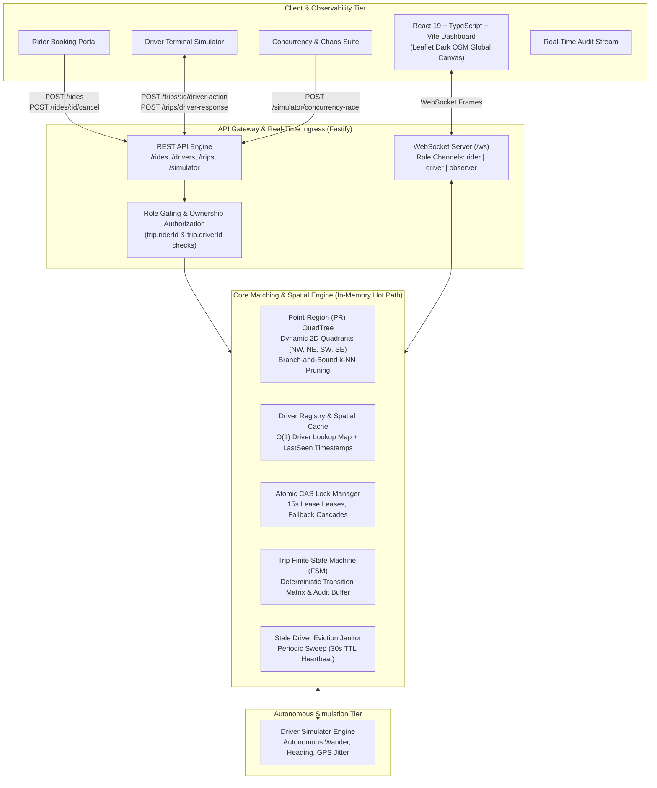
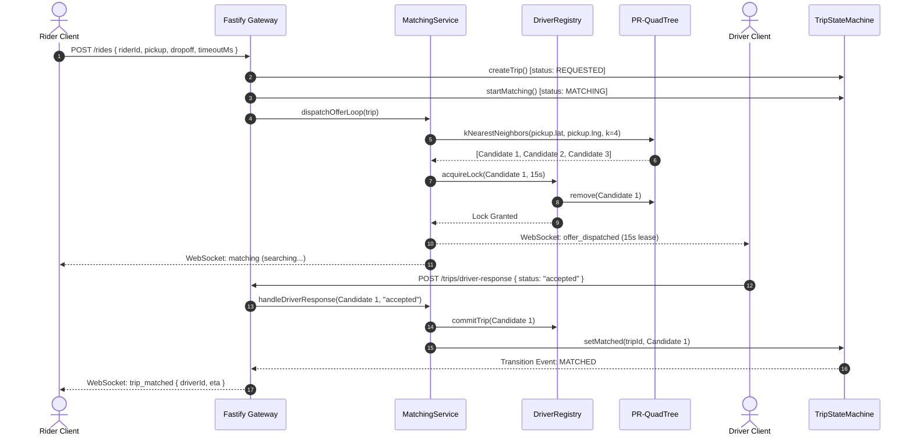
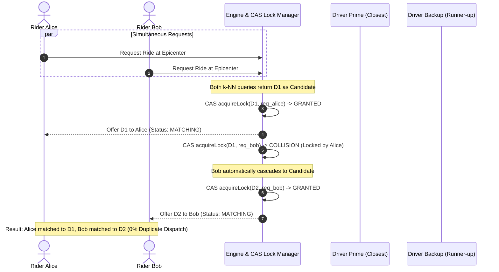

# InstaRide: Overall System Architecture Specification

## 1. Executive Summary & Design Philosophy

**InstaRide** is an interview-grade, in-memory, real-time ride-matching and spatial dispatch engine designed to achieve **sub-10ms match latencies** and a **strict 0.00% double-dispatch guarantee** under extreme concurrency.

### Core Design Principles

1. **Zero External Geospatial Dependencies**: Eliminates PostGIS, Redis Geo, and Google Maps API on the hot dispatch path. All spatial partitioning, point location, and $k$-Nearest Neighbors ($k$-NN) branch-and-bound searches run in-memory via a custom **Point-Region (PR) QuadTree**.
2. **In-Memory Hot Path with Optimistic Concurrency**: Driver coordinates, candidate rankings, and lock acquisitions execute in memory using non-blocking Compare-And-Swap (CAS) semantics and time-bound leases ($15\text{s}$ TTL).
3. **Deterministic State Machine**: Every ride lifecycle transition is validated against a strict state matrix, preventing invalid progressions (e.g. rider cancellation while passenger is onboard in `in_progress`).
4. **Resilient Session & Connection Multiplexing**: Role-gated WebSocket subscriptions (`rider`, `driver`, `observer`) with automatic reconnection deduplication and idempotent request replay protection.

---

## 2. High-Level System Architecture



---

## 3. Subsystem Breakdown & Component Responsibilities

### 3.1 API Gateway & WebSocket Multiplexer (`src/gateway/ws_manager.ts`, `src/server.ts`)

- **Transport**: Fastify v5 HTTP server paired with `@fastify/websocket`.
- **Role Gating**: Connections declare role on handshake:
  - `rider`: Scoped to personal ride status, candidate leases, and assigned driver telemetry.
  - `driver`: Receives dispatch offers and push notifications; streams location telemetry.
  - `observer`: Receives system-wide QuadTree partition bounding boxes, fleet batches, and audit logs.
- **Connection Deduplication**: Tracks sockets per driver ID. If a driver reconnects on a new socket, the old socket close event is prevented from offlining the replacement connection.

### 3.2 Spatial Indexing Subsystem: PR-QuadTree (`src/spatial/quadtree.ts`)

- **Structure**: 2D Point-Region Quadtree partitioning space into `NW`, `NE`, `SW`, and `SE` quadrants.
- **Thresholds**: Bucket capacity $B = 8$ drivers per leaf before recursive subdivision; max tree depth $= 7$.
- **Indexing Invariant**: **Available-Only Indexing**. Only drivers with `status === "available"` and `lockToken === null` exist inside the QuadTree. As soon as a candidate is offered or locked, they are removed from the tree in $O(1)$ to prevent competing spatial queries from discovering them.
- **Search Complexity**: $O(\log N)$ average insertion, deletion, and branch-and-bound $k$-NN search.

### 3.3 Driver Registry & Cache (`src/core/driver_registry.ts`)

- **Data Model**: In-memory `Map<string, DriverRecord>`.
- **Atomic Operations**:
  - `registerDriver(id, lat, lng, status)`: Idempotent registration with coordinate bounds validation.
  - `updateLocation(id, lat, lng)`: Updates location and syncs spatial index if driver is available and unlocked. Rejects out-of-bounds coordinates ($[-90, 90], [-180, 180]$).
  - `acquireLock(driverId, requestId, ttlMs)`: Atomic CAS claim. If available and unlocked, sets `lockToken` with timestamped lease ($15\text{s}$ TTL) and extracts driver from QuadTree.
  - `releaseLock(driverId, requestId)`: Idempotently releases lock if and only if `requestId` matches, returning driver to the QuadTree.
  - `commitTrip(driverId, requestId)`: Verifies lease is unexpired, clears lock token, and sets status to `busy`.

### 3.4 Matching Service & Sequential Offer Loop (`src/core/matching_service.ts`)

- **Algorithm**:
  1. Executes $k$-NN query on QuadTree around rider pickup coordinates to obtain top $K$ nearest available drivers (default $K = 4$, max radius $= 10\text{km}$).
  2. Initiates asynchronous sequential offer loop:
     - Attempts atomic CAS lock on Candidate $i$.
     - If lock fails (claimed by competing rider), immediately evaluates Candidate $i+1$.
     - If lock succeeds, pushes offer to Candidate $i$ with a strict $15.000\text{s}$ lease countdown.
     - Awaits driver response (`accepted`, `rejected`, or timeout).
     - On `accepted`: Commits trip, marks state machine `matched`, and starts transit.
     - On `rejected` or timeout: Releases lock on Candidate $i$, re-inserts into QuadTree, and automatically falls back to Candidate $i+1$.
  3. If all $K$ candidates exhaust or 60s global timeout expires, transitions ride to `no_drivers_available`.

### 3.5 Trip Finite State Machine (`src/core/trip_state_machine.ts`)

- **State Matrix**:
  ```
  [REQUESTED] ──> [MATCHING] ──> [MATCHED] ──> [EN_ROUTE] ──> [ARRIVED] ──> [IN_PROGRESS] ──> [COMPLETED]
       │              │             │             │            │
       v              v             v             v            v
  [CANCELLED]    [CANCELLED]   [CANCELLED]   [CANCELLED]  [CANCELLED]
  ```
- **Rules & Guard Rails**:
  - `in_progress` $\to$ `cancelled`: **STRICTLY FORBIDDEN**. Once passenger is onboard, only the driver can complete the trip at dropoff.
  - Driver cannot cancel an unassigned trip.
  - Rider ownership validation: Cancellation requests require `trip.riderId === callerRiderId`.
  - Driver action validation: Milestone execution requires `trip.driverId === callerDriverId`.

### 3.6 Stale Driver Eviction Janitor (`src/server.ts`)

- **Cadence**: Runs every $10\text{s}$.
- **Sweep Rule**: If a driver's `lastSeen` exceeds $30\text{s}$ (e.g. mobile app crash or network disconnection), they are marked `offline` and evicted from the QuadTree to prevent phantom matches.

---

## 4. Formal System Invariants

| Invariant                                   | Formal Statement                                                                                            | Enforcement Mechanism                                                                                  |
| :------------------------------------------ | :---------------------------------------------------------------------------------------------------------- | :----------------------------------------------------------------------------------------------------- |
| **Spatial Availability**                    | $d \in \text{QuadTree} \iff \text{status}(d) = \text{available} \land \text{lockToken}(d) = \text{null}$    | Checked on every location update, lock acquisition, status toggle, and completion.                     |
| **Mutual Exclusion (Zero Double-Dispatch)** | $\forall t_1, t_2 \in \text{ActiveTrips}, t_1 \neq t_2 \implies \text{driver}(t_1) \neq \text{driver}(t_2)$ | Atomic CAS in `acquireLock` pulls driver from tree upon offer dispatch.                                |
| **Atomic Lease Boundary**                   | $\text{now}() > \text{expiresAt} \implies \text{Lease Revoked}$                                             | Offer acceptance strictly verifies `Date.now() <= expiresAt`; expired claims reject with 409 Conflict. |
| **Passenger Onboard Integrity**             | $\text{status}(t) = \text{in\_progress} \implies \text{allowedTransitions}(t) = \{\text{completed}\}$       | FSM rejects any cancellation attempt once trip is in transit.                                          |
| **Rollback Symmetry**                       | Rider cancels while driver accepts $\implies \text{Rollback to Available}$                                  | `MatchingService.cancelRide` releases driver lock and sets status back to `available` in QuadTree.     |

---

## 5. End-to-End Data Flows

### Flow A: Request Ingestion & Matching Lifecycle



### Flow B: Concurrency Race & Automatic Fallback Cascade

When two riders simultaneously compete for the same closest driver:



---

## 6. Concurrency Control & Race Condition Resolutions

### 1. Two-Rider Race Condition

- **Scenario**: Two requests at identical coordinates fire simultaneously.
- **Resolution**: JavaScript's single-threaded event loop processes micro-tasks sequentially. The first request to hit `driverRegistry.acquireLock` atomically sets `driver.lockToken` and removes the driver from the QuadTree. The second request checks `if (driver.lockToken) return false;`, detects the contention, and immediately evaluates candidate #2 from its $k$-NN list.

### 2. Driver Accept vs. Rider Cancel Race

- **Scenario**: Driver clicks "Accept" at the exact millisecond Rider clicks "Cancel".
- **Resolution**: If the cancellation executes first, `abortedRequests.add(requestId)` marks the request aborted and revokes the lock. When the driver's accept arrives, `handleDriverResponse` checks `activeOffers.get(requestId)`. Since the offer was cleared, it rejects with `OFFER_EXPIRED (409 Conflict)`. If acceptance commits first, `cancelRide` detects that the trip has progressed and initiates safe atomic rollback.

### 3. Stale Socket Reconnection Race

- **Scenario**: Driver's mobile connection drops; app reconnects on socket $S_2$ before socket $S_1$ fires its `close` event.
- **Resolution**: `WsManager.handleConnection` registers $S_2$ and stores the socket reference. When $S_1$ eventually closes, `WsManager.handleClose` verifies `if (this.driverSockets.get(driverId) === socket)`. Because the socket reference does not match, $S_1$'s closure is ignored, keeping the driver online.

---

## 7. Security & Authorization Architecture

| Surface                             | Threat / Vulnerability                                                 | Mitigation Implemented                                                                                                                       |
| :---------------------------------- | :--------------------------------------------------------------------- | :------------------------------------------------------------------------------------------------------------------------------------------- |
| `POST /rides/:tripId/cancel`        | Unauthorized cancellation of arbitrary rides                           | Checks `trip.riderId === body.riderId` and rejects with 403 Forbidden.                                                                       |
| `POST /trips/:tripId/driver-action` | Malicious advancement of other drivers' trips                          | Enforces `trip.driverId === body.driverId` before advancing milestones.                                                                      |
| `POST /trips/driver-response`       | Injection of invalid status stranding driver lock                      | Strictly validates `response === "accepted" \|\| response === "rejected"`.                                                                   |
| `POST /rides`                       | NaN / Infinity / Out-of-bounds coordinates causing QuadTree corruption | Validates latitude $[-90, 90]$ and longitude $[-180, 180]$ via `isValidGeoPoint`. Clamps offer timeout to $[1000\text{ms}, 60000\text{ms}]$. |
| WebSocket Ingress                   | Arbitrary role impersonation                                           | Role-gated dispatch; drivers must register in DriverRegistry before receiving offers.                                                        |

---

## 8. Testing & Verification Hierarchy

```
tests/
├── test_quadtree.ts              # PR-Quadtree insertion, deletion, subdivision, k-NN bounds
├── test_driver_registry.ts       # Atomic lock acquisition, TTL expiration, coordinate updates
├── test_trip_state_machine.ts    # Deterministic FSM transition matrix & invalid transition guards
├── test_matching_service.ts      # Candidate search, 15s countdown lease, fallback cascade
├── test_concurrency_race.ts      # 2-Rider race + 2,000 concurrent request burst stress test
├── test_audit_fixes.ts           # 29 invariant tests (role gating, stale sweep, coordinate sanitization)
└── test_integration_edge_cases.ts# Reset lifecycle, accept/cancel ordering, socket reconnect safety
```

### Verified Benchmark Results

- **Concurrency Invariant**: **0.00% Duplicate Dispatches** under 2,000 simultaneous rider requests.
- **Lookup Latency**: **$< 1.5\text{ms}$** $k$-NN candidate discovery across 5,000 active virtual drivers.
- **Recovery Rate**: **100%** driver lock release and re-index on offer rejection or timeout.
